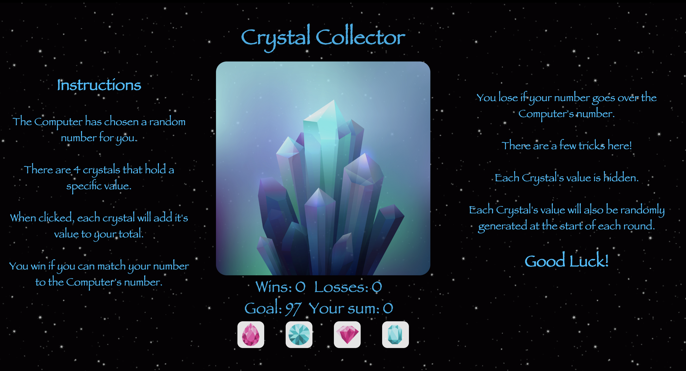

# crystal-collector

## Overview
A fun JQuery guessing game. 

This is a front-end application that utilizes `HTML5`, `CSS`, `JavaScript`, and `JQuery`. This particular project highlights using jQuery to dynamically update the HTML of the application.

## How to play
You will be given a random number at the start of the game. Use the crystals to match your points to the random number. The value of the crystals changes for every game and you must figure out their values on your own.

Match your points to the random number to win. If you go over, you lose!

### [Play the game!](https://sweetmike.github.io/crystal-collector/)

Technologies: HTML5 | CSS | JQuery | JavaScript
